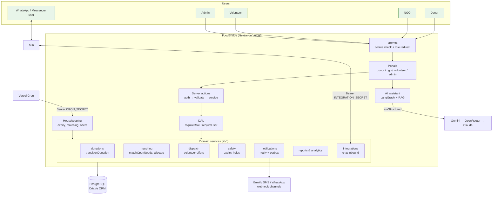
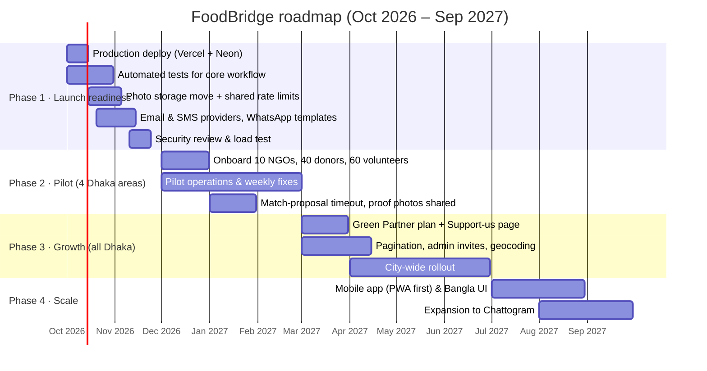

# FoodBridge — Product Requirements Document (PRD)

**Product:** FoodBridge, a surplus-food donation platform
**Initiative:** FoodWasteZero, Dhaka, Bangladesh
**Document version:** 1.0
**Date:** 30 September 2026
**Status:** MVP built; preparing for pilot launch

---

## Contents

1. [Project Summary](#1-project-summary)
2. [Problem Statement & Solution](#2-problem-statement--solution)
3. [Technology & System Architecture](#3-technology--system-architecture)
4. [Business Model (Fund Collection)](#4-business-model-fund-collection)
5. [Beneficiaries](#5-beneficiaries)
6. [Current Status](#6-current-status)
7. [Development Timeline](#7-development-timeline)
8. [Budget (AI Models, Hosting & Maintenance)](#8-budget-ai-models-hosting--maintenance)

---

## 1. Project Summary

FoodBridge is a web platform that moves surplus food from restaurants, hotels, shops and households to NGOs, shelters and community kitchens in Dhaka before the food expires. Volunteers carry it.

It has four connected portals:

| Role | What they do on FoodBridge |
| --- | --- |
| **Donor** (restaurant, hotel, shop, caterer, household) | Posts surplus food with quantity, category, best-before time, pickup location and an optional photo, then tracks it until it is delivered. |
| **NGO** (shelter, orphanage, community kitchen) | Finds available food, requests it directly or posts a food need that the system matches, confirms delivery and records meals served. |
| **Volunteer** | Gets nearby pickup offers, accepts tasks, confirms pickup and delivery with timestamps and optional proof photos. |
| **Admin** (FoodWasteZero team) | Verifies NGOs and volunteers, watches food safety, fixes stuck deliveries, reviews reports and the activity log. |

**Vision:** no safe food in Dhaka goes to waste while people nearby go hungry.

**Goals for the first 12 months**

| Goal | Target |
| --- | --- |
| Verified NGOs on the platform | 50 |
| Active donors (posted in the last 30 days) | 200 |
| Verified volunteers | 300 |
| Meals delivered | 100,000 |
| Donations delivered before expiry | 90% or more |
| Average time from posting to pickup | Under 90 minutes |
| Food-safety incidents | Zero |

---

## 2. Problem Statement & Solution

### 2.1 The problem

- **Food is wasted at scale.** Bangladesh wastes millions of tonnes of food each year. The UNEP Food Waste Index estimates roughly 80 kg of household food waste per person per year. Restaurants, hotels, wedding and event caterers in Dhaka throw away cooked food every day.
- **People nearby are hungry.** Many people in Dhaka's low-income communities, street children and shelter residents do not get enough food, often within a few kilometres of that waste.
- **Donation happens informally, if at all.** Donors don't know which NGO needs food right now. NGOs learn about surplus through phone calls and personal contacts. Nobody coordinates transport.
- **Cooked food has a short safe window.** Without fast matching and pickup, food spoils before it reaches anyone. Donors worry about liability if unsafe food is served.
- **There is no record of impact.** Donors (especially businesses reporting CSR/ESG results) and funders cannot see how much food was saved or how many people were fed.

### 2.2 The solution

FoodBridge replaces phone calls with one controlled workflow:

```
Donor posts food → NGO is matched → Volunteer picks up → Delivered → NGO records meals served
   PENDING           MATCHED          ASSIGNED → PICKED_UP → IN_TRANSIT → DELIVERED → COMPLETED
```

| Problem | How FoodBridge solves it |
| --- | --- |
| Donors don't know who needs food | NGOs post **food needs**. The system **matches automatically**, ranking by expiry (40%), distance (35%) and quantity fit (25%). NGOs can also request any listed donation directly. |
| Donations are too large or too small | **Partial allocation** splits a large donation; the rest stays available to other NGOs. |
| Nobody handles transport | Pickups are offered to **one volunteer at a time, nearest first**. If nobody answers in time, the task opens to all available volunteers. |
| Food spoils or becomes unsafe | **Food-safety rules** cap best-before per food category, show "Expiring soon" warnings, expire food automatically and let admins put food on a **safety hold**. Expired food can never be assigned. |
| Trust between strangers | NGOs and volunteers are **verified by admins** before they can act. Contact details are shared only after someone commits to a delivery. |
| No proof of impact | Every status change is logged in a timeline. Admin and NGO **reports** (by month, area, donor type, category) and **CSV exports** show meals delivered. |
| Not everyone uses a website | A **WhatsApp / Messenger bot** (via n8n) lets users post donations and needs by chat and receive status updates. |
| New users need help | An **AI assistant** answers questions from approved help content and drafts forms for the user to check. It never makes decisions. |

### 2.3 Scope

**In scope (MVP):** web portals for all four roles, matching and allocation, volunteer dispatch, maps and optional live location, food safety, notifications, AI assistant, chat bot integration, reports and admin tools.

**Out of scope (for now):** native mobile apps, payment processing inside the app, a routing engine (routes are straight lines), recipient-level records (recipients are counted as meals and service area only, to protect their privacy).

---

## 3. Technology & System Architecture

### 3.1 Technology stack

| Layer | Technology | Why |
| --- | --- | --- |
| Framework | **Next.js 16** (App Router, Server Actions, Turbopack) | One codebase for pages, server logic and API routes. |
| UI | **React 19**, **Tailwind CSS v4**, Leaflet maps (loaded lazily) | Fast, mobile-first, accessible UI. |
| Language | **TypeScript** (strict) | Fewer bugs in a workflow-heavy app. |
| Database | **PostgreSQL** via **Drizzle ORM**. **PGlite** (embedded Postgres) for local development; hosted Postgres (e.g. Neon) in production via `DATABASE_URL`. | Transactions and conditional updates keep concurrent actions safe. |
| Auth | Signed JWT sessions in httpOnly cookies (**jose**), **bcrypt** password hashes, session versioning | Sign-out everywhere on password change or suspension. |
| Validation | **zod 4** | The same schemas validate web forms and chat drafts. |
| AI (optional) | **LangGraph** with a provider chain **Gemini → OpenRouter → Claude** | Cheap by default, with a fallback if one provider is busy. |
| Automation (optional) | **n8n** | Connects WhatsApp and Messenger without changing app code. |
| Hosting | **Vercel** (daily cron for housekeeping) + hosted Postgres | Zero-ops deployment. |

### 3.2 System architecture



### 3.3 Key design rules

- **One workflow gate.** Every donation status change goes through `transitionDonation()`. A conditional `UPDATE … WHERE status IN (…)` makes concurrent actions safe (for example, two volunteers accepting the same task at once). Each change writes a timeline event and sends notices.
- **Safety first.** Food past its best-before, or on an admin safety hold, can never be matched or assigned.
- **AI never decides.** The assistant only answers from approved content and drafts forms that the user submits. It never writes to the database and is not used by matching, expiry, safety or permissions. All LLM calls go through one file (`lib/ai/provider.ts`) and every reply is validated.
- **Security.** Auth is re-checked in the database on every page, action and route. Ownership is enforced in queries. Login and sign-up are rate-limited. Uploads are checked by file signature. Security headers and CSP are set. Exports never include emails, phones, addresses or coordinates.
- **Privacy.** Contact details are shared only after commitment. Private homes are shown rounded to about 1 km. Live location is opt-in and deleted when the delivery ends.

### 3.4 Main data entities

`users` · `donations` · `donation_events` · `food_requests` · `food_needs` · `match_events` · `task_offers` · `live_locations` · `notifications` · `notification_deliveries` · `ai_conversations` / `ai_messages` · `activity_log` · chat link tables.

---

## 4. Business Model (Fund Collection)

FoodBridge is run as a **non-profit service**. Food is always free for NGOs and recipients, and posting food is always free for donors. Money is raised to cover hosting, AI, messaging, staff and volunteer support.

### 4.1 Funding sources

| # | Source | How it works | Expected share (Year 1) |
| --- | --- | --- | --- |
| 1 | **Grants** | Apply to food-security, climate and youth programmes (e.g. UN WFP / FAO partners, embassies, foundations, Bangladesh government social-welfare and ICT grants, university innovation funds). | 35% |
| 2 | **Corporate CSR sponsorship** | Banks, telecoms and FMCG companies sponsor FoodBridge as part of their CSR spending. Sponsors get logo placement, an impact report and employee-volunteering days. | 25% |
| 3 | **"Green Partner" business plan** | Restaurants, hotels and caterers pay a small monthly fee (e.g. BDT 1,000–3,000) for a verified **Green Partner badge**, monthly **impact certificates** (meals donated, kg saved, CO₂e avoided) for ESG/CSR reports, and priority pickup. Basic posting stays free. | 20% |
| 4 | **Public donations & crowdfunding** | Individuals give through bKash, Nagad, card or bank transfer, with campaigns at Ramadan, Eid and winter. A public "meals delivered" counter shows the impact. | 10% |
| 5 | **Event partnerships** | Wedding halls, convention centres and event planners pay a per-event fee for guaranteed surplus pickup after large events. | 5% |
| 6 | **In-kind support** | Donated cloud credits (Vercel, Google Cloud for Nonprofits, AWS credits), free SMS quotas from telecoms, pro-bono design and legal help. | 5% |

### 4.2 Fund collection plan

1. **Register** FoodWasteZero as a non-profit (NGO Affairs Bureau or Social Welfare registration) so it can receive grants and CSR money.
2. **Add a "Support us" page** on the public site with bKash / Nagad merchant numbers, bank details and a live impact counter.
3. **Publish quarterly impact reports**, generated from the existing admin reports and CSV exports, for sponsors and grant-makers.
4. **Launch the Green Partner plan** after the pilot proves delivery reliability.
5. **Keep books transparent.** Publish how money is spent (hosting, staff, volunteer transport allowances).

### 4.3 Use of funds

| Category | Share |
| --- | --- |
| Staff (operations coordinator, part-time developer) | 45% |
| Volunteer support (transport allowance, insulated food bags, safety kits) | 20% |
| Technology (hosting, database, AI, messaging) | 15% |
| Outreach and partner onboarding | 10% |
| Contingency | 10% |

---

## 5. Beneficiaries

### 5.1 Direct beneficiaries

| Group | Benefit |
| --- | --- |
| **People facing hunger** (shelter residents, street children, orphanages, low-income families served by community kitchens) | More, and more regular, safe meals at no cost. |
| **NGOs and community kitchens** | A reliable food supply without the cost of buying or collecting it; tools to post needs, track deliveries and report meals served to their own funders. |
| **Volunteers** (students, young professionals) | Meaningful local volunteering close to home, with a record of deliveries and meals delivered they can use as a certificate or reference. |

### 5.2 Indirect beneficiaries

| Group | Benefit |
| --- | --- |
| **Donors** (restaurants, hotels, shops, caterers, households) | Lower waste-disposal costs, CSR/ESG impact evidence, community goodwill and a safe, trackable way to donate. |
| **City and environment** | Less organic waste going to landfill and less methane. Each kilogram of food saved avoids about 2.5 kg CO₂e. |
| **Researchers and policy makers** | Anonymised data on food surplus by area, category and season. |

### 5.3 Target area

Pilot areas in Dhaka: **Dhanmondi, Mohammadpur, Mirpur and Gulshan–Banani**, which combine many restaurants and hotels with many NGOs and low-income communities. Expansion to all of Dhaka, then Chattogram, follows.

---

## 6. Current Status

**Overall: MVP feature-complete, not yet launched.** The code is on the `main` branch and being prepared for production on Vercel with hosted Postgres.

### 6.1 Built and working

| Module | Status |
| --- | --- |
| Foundation: design system, public homepage with live impact stats | ✅ Done |
| Authentication: JWT sessions, per-role registration, profile, password change | ✅ Done |
| Donor portal: post donation with photo, dashboard, tracking timeline, cancellation | ✅ Done |
| NGO module: registration + verification, find food, direct requests, meals served | ✅ Done |
| Volunteer module: registration + verification, availability, tasks, pickup/delivery proof | ✅ Done |
| Admin module: dashboard, user management, donation and request management, activity log | ✅ Done |
| Food donation lifecycle with automatic expiry | ✅ Done |
| Food needs and automatic matching | ✅ Done |
| Matching & partial allocation (scored, with history) | ✅ Done |
| Pickup & delivery: nearest-volunteer offers, timeouts, in-transit step | ✅ Done |
| Location & maps: pins, Google Maps navigation, opt-in live location, role maps | ✅ Done |
| Food safety: rules, badges, admin hold, expiry warnings | ✅ Done |
| Notifications: categories, read/unread, channel preferences, webhook outbox | ✅ Done |
| AI assistant: RAG help, form drafting, chat history, no-AI fallback | ✅ Done |
| Dashboards & analytics: "over time" charts per role | ✅ Done |
| WhatsApp / Messenger via n8n: account linking, DONATE / NEED / STATUS by chat | ✅ Done (template workflow, not tested against a live account) |
| Admin monitoring: "Needs attention" queue and resolutions | ✅ Done |
| Security hardening: session versioning, rate limits, CSP, upload checks | ✅ Done |
| Responsive & accessible UI (320–1440 px) | ✅ Done |
| Data & reporting: admin/NGO reports, CSV exports | ✅ Done |
| Production database support (hosted Postgres via `DATABASE_URL`) | ✅ Done |

### 6.2 Known gaps before launch

| Gap | Impact | Plan |
| --- | --- | --- |
| No automated test suite | Regressions possible | Add tests for the donation workflow, matching and dispatch. |
| Housekeeping cron runs once a day on Vercel (plus on page loads) | Expiry and volunteer-offer timeouts may lag when nobody is online | Move to Vercel Pro and run the cron every 5 minutes. |
| Photos stored in Postgres | Database grows quickly | Move to object storage (Vercel Blob or S3-compatible). |
| Rate limits and AI limits in memory per process | Weaker with several server instances | Move to a shared store (e.g. Upstash Redis). |
| Notification channels are webhook adapters only | No real email/SMS yet | Connect providers (Resend, a Bangladeshi SMS gateway, WhatsApp Cloud API). |
| WhatsApp outside the 24-hour window needs approved templates | Some updates can't be sent | Create and approve message templates. |
| No geocoding or routing engine | Pins set by GPS/map tap; routes are straight lines | Add geocoding later if users struggle. |
| No match-proposal timeout | A slow NGO can hold a donation | Add a timeout like volunteer offers. |
| Admin lists capped at 100 rows, no pagination; no UI to add admins | Harder admin work at scale | Add pagination and an admin invite flow. |
| Proof photos visible only to the volunteer | Less trust for donors/NGOs | Show proof photos to the donor and NGO. |

---

## 7. Development Timeline

### 7.1 Completed (Phase 0 — MVP build)

| Period | Work |
| --- | --- |
| Up to September 2026 | Foundation, authentication, donor, NGO, volunteer and admin portals; food lifecycle; matching and allocation; pickup and delivery; maps; food safety; notifications; AI assistant; analytics; WhatsApp/Messenger; monitoring; security; accessibility; reporting (Segments 01–21). |
| 30 September 2026 | Hosted Postgres support for Vercel deployment. |

### 7.2 Upcoming phases



| Phase | Dates | Main deliverables | Exit criteria |
| --- | --- | --- | --- |
| **1. Launch readiness** | Oct – Nov 2026 | Production deployment, core tests, object storage, real email/SMS, WhatsApp templates, security review | All tests pass; no critical security findings; frequent cron running |
| **2. Pilot** | Dec 2026 – Feb 2027 | 4 pilot areas, 10 NGOs, 40 donors, 60 volunteers; weekly improvements | 10,000 meals delivered; 90%+ delivered before expiry |
| **3. Growth** | Mar – Jun 2027 | Green Partner plan, fundraising page, admin tools at scale, city-wide rollout | 50 NGOs, 200 active donors, costs covered by funding |
| **4. Scale** | Jul – Sep 2027 | Installable mobile app (PWA), full Bangla interface, second city | 100,000 meals delivered in total |

---

## 8. Budget (AI Models, Hosting & Maintenance)

> **Assumptions:** 1 USD ≈ 122 BDT. Prices are list prices as of September 2026 and **must be re-checked with each provider before purchase**; providers change them often. Usage is estimated for three stages: **Pilot** (about 500 users), **Growth** (about 3,000 users) and **Scale** (about 15,000 users).

### 8.1 AI model choice and cost

FoodBridge's assistant does light work: short help answers from approved content (RAG) and form drafting. It does not need a top-tier model. The app already tries providers in order (Gemini → OpenRouter → Claude), so the cheapest reliable model should be first.

**Estimated usage per assistant message:** about 4,000 input tokens (question + retrieved help content + history) and 600 output tokens, across the classify and answer steps.

| Model | Price per 1M tokens (input / output) | Cost per message | Fit for FoodBridge |
| --- | --- | --- | --- |
| **Gemini 2.5 Flash-Lite** | $0.10 / $0.40 | ≈ $0.0006 | ✅ Cheapest; fine for FAQ answers and drafts |
| **Gemini 2.5 Flash** | $0.30 / $2.50 | ≈ $0.0027 | ✅ **Recommended primary**: better Bangla and form drafting |
| **OpenRouter free models** | $0 (strict rate limits) | $0 | ✅ Good second fallback; not reliable enough to rely on |
| **Claude Haiku 4.5** | $1.00 / $5.00 | ≈ $0.007 | ✅ **Recommended paid fallback**: reliable structured JSON |
| Claude Sonnet / Opus class | $3+ / $15+ | ≈ $0.02 – $0.05 | ❌ Too expensive for this use. Change `AI_MODEL` from the Opus default in `.env.example` to Haiku |

**Recommended setup**

```env
GEMINI_MODEL=gemini-2.5-flash,gemini-2.5-flash-lite
OPENROUTER_MODEL=openrouter/free
AI_MODEL=claude-haiku-4-5
AI_EFFORT=low
```

During the pilot, the **Gemini free tier** will likely cover all traffic, so the AI cost can be **$0**.

**Monthly AI cost estimate**

| Stage | Assistant messages / month | Gemini Flash (primary, ~90%) | Claude Haiku fallback (~10%) | **Total / month** |
| --- | --- | --- | --- | --- |
| Pilot | 2,000 | $0 (free tier) | ≈ $1.40 | **≈ $2 (BDT 250)** |
| Growth | 15,000 | ≈ $36 | ≈ $10.50 | **≈ $47 (BDT 5,700)** |
| Scale | 60,000 | ≈ $146 | ≈ $42 | **≈ $188 (BDT 23,000)** |

**Cost controls already built in:** per-user assistant rate limit, a no-AI help mode when no key is set, and provider fall-through. Add a monthly spending cap in the Google AI Studio and Anthropic consoles.

### 8.2 Hosting, infrastructure and services (monthly)

| Item | Recommended option | Pilot | Growth | Scale |
| --- | --- | --- | --- | --- |
| App hosting | Vercel Pro (1 seat; frequent cron, commercial use allowed) | $20 | $20 | $40 – $80 |
| Database | Neon Postgres (via Vercel Marketplace) | $0 (free tier) | $19 | $69 |
| Photo storage | Vercel Blob / S3-compatible | $0 – $1 | $3 | $10 |
| Shared rate limit store | Upstash Redis | $0 (free tier) | $0 – $10 | $10 |
| Email | Resend (3,000/month free) | $0 | $20 | $20 |
| SMS (Bangladesh gateway, ≈ BDT 0.35 / SMS) | Local SMS gateway | $3 (1,000 SMS) | $15 (5,000) | $60 (20,000) |
| WhatsApp Cloud API (template messages outside 24 h) | Meta, direct | $0 – $5 | $15 | $50 |
| n8n (chat automation) | Self-hosted on a small VPS | $6 | $6 | $12 |
| Map tiles | OpenStreetMap (pilot); paid tile provider later | $0 | $0 | $0 – $50 |
| Monitoring / error tracking | Sentry free tier / Vercel Observability | $0 | $0 – $26 | $26 |
| AI (from 8.1) | Gemini + Claude Haiku | $2 | $47 | $188 |
| **Technology total / month** | | **≈ $35 (BDT 4,300)** | **≈ $195 (BDT 23,800)** | **≈ $600 (BDT 73,000)** |

**Yearly fixed items**

| Item | Cost / year |
| --- | --- |
| Domain (`.org` or `.com.bd`) | $15 – $25 |
| SSL | $0 (included with Vercel) |
| **Total** | **≈ $25 (BDT 3,000)** |

### 8.3 Maintenance and people (monthly)

| Role | Pilot | Growth | Scale |
| --- | --- | --- | --- |
| Part-time full-stack developer (maintenance, fixes, small features) | BDT 30,000 | BDT 50,000 | BDT 80,000 (full-time) |
| Operations coordinator (verify partners, monitor deliveries) | BDT 20,000 (part-time) | BDT 35,000 | BDT 70,000 (2 people) |
| Volunteer support (transport allowance, food bags, safety kits) | BDT 15,000 | BDT 40,000 | BDT 100,000 |
| Outreach and partner onboarding | BDT 5,000 | BDT 15,000 | BDT 30,000 |
| **People & operations total** | **BDT 70,000** | **BDT 140,000** | **BDT 280,000** |

### 8.4 Budget summary

| | Pilot (monthly) | Growth (monthly) | Scale (monthly) |
| --- | --- | --- | --- |
| Technology (hosting, DB, AI, messaging) | BDT 4,300 | BDT 23,800 | BDT 73,000 |
| People & operations | BDT 70,000 | BDT 140,000 | BDT 280,000 |
| Contingency (10%) | BDT 7,400 | BDT 16,400 | BDT 35,300 |
| **Total per month** | **≈ BDT 81,700 (≈ $670)** | **≈ BDT 180,200 (≈ $1,480)** | **≈ BDT 388,300 (≈ $3,180)** |

**First-year budget (following the timeline in section 7)**

| Period | Months | Stage | Estimated cost |
| --- | --- | --- | --- |
| Oct – Nov 2026 (launch readiness) | 2 | Pilot rate | BDT 163,400 |
| Dec 2026 – Feb 2027 (pilot) | 3 | Pilot rate | BDT 245,100 |
| Mar – Jun 2027 (growth) | 4 | Growth rate | BDT 720,800 |
| Jul – Sep 2027 (scale) | 3 | Scale rate | BDT 1,164,900 |
| Yearly fixed items | — | — | BDT 3,000 |
| **Year 1 total** | **12** | | **≈ BDT 2.3 million (≈ $18,800)** |

**Cost per meal:** at the Year 1 target of 100,000 meals delivered, the platform costs about **BDT 23 (≈ $0.19) per meal delivered**. This falls as volume grows, because technology costs rise much more slowly than meals delivered.

### 8.5 Ways to lower costs

- Use the **Gemini free tier** and **OpenRouter free models** during the pilot; turn on Claude Haiku only as a paid fallback.
- Apply for **nonprofit cloud credits** (Google for Nonprofits, AWS Imagine Grant, Vercel/Neon startup or OSS programmes).
- Ask a telecom CSR partner for **free SMS quotas**.
- Prefer **in-app and WhatsApp service messages** (free inside the 24-hour window) over SMS.
- Keep the AI assistant optional: the app works fully without it (no-AI help mode).

---

*Prepared for the FoodWasteZero initiative. Figures are planning estimates, not quotes.*
