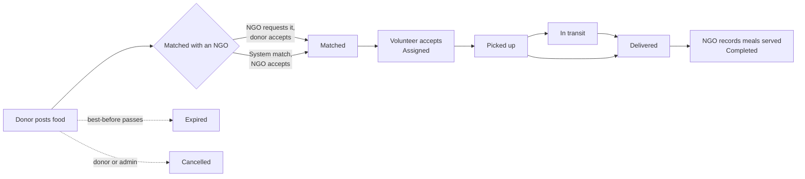

<div align="center">

# 🍲 FoodBridge

**Rescue surplus food. Feed people, not landfills.**

A surplus-food donation platform for the **FoodWasteZero** initiative in Dhaka. It connects restaurants, hotels, shops and households with NGOs and volunteers, so good food reaches people in need before it expires.


</div>

---

## Contents

- [Overview](#overview)
- [Features](#features)
- [How it works](#how-it-works)
- [Tech stack](#tech-stack)
- [Getting started](#getting-started)
- [Configuration](#configuration)
- [Project structure](#project-structure)
- [Security](#security)
- [Accessibility and responsive design](#accessibility-and-responsive-design)
- [Deployment](#deployment)
- [Known limitations](#known-limitations)

## Overview

Every day, restaurants, hotels and homes throw away food that is still safe to eat, while nearby shelters and community kitchens struggle to feed people. FoodBridge closes that gap with four connected portals:

| Role | What they do |
| --- | --- |
| **Donor** | Posts surplus food with quantity, best-before time, pickup address and an optional photo, then follows it until it is delivered. |
| **NGO** | Finds available food, requests it or posts its own food needs, confirms deliveries and records how many meals were served. |
| **Volunteer** | Receives nearby pickup offers, accepts tasks, and confirms pickup and delivery (with an optional note and photo). |
| **Admin** | Verifies partners, monitors the platform, resolves stuck deliveries, and reviews reports and the activity log. |

## Features

### Donation lifecycle
- One controlled workflow for every donation, with a full timeline of who did what and when.
- **Food-safety rules** per food type: best-before limits, "expiring soon" warnings and automatic expiry.
- Admins can put food on a **safety hold** or withdraw it as unsafe.

### Matching and allocation
- NGOs can **request food directly**, or post a **food need** that the system matches automatically.
- Matches are ranked by a deterministic score: expiry 40%, distance 35%, quantity fit 25%.
- **Partial allocation**: a large donation is split, and the remainder stays available to other NGOs.

### Pickup and delivery
- Tasks are offered to **one volunteer at a time, nearest first**. If nobody answers in time, the task opens to every available volunteer.
- Steps: Accept → Pickup → Start delivery → Deliver. Each step is timestamped, and pickup and delivery can carry a proof photo.
- **Maps** with pickup and delivery pins, Google Maps navigation, and opt-in live location while a delivery is in progress.

### Admin control
- Dashboard with platform statistics, impact figures, a verification queue and a **"Needs attention"** list of stuck work.
- Search and filter users, donations and requests. Verify, suspend, deactivate or reactivate accounts, and edit or cancel records.
- Fix stuck work: offer a pickup to a chosen volunteer, record a delivery nobody confirmed, or record meals served for an NGO.
- **Activity log** of important actions and security events.
- **Reports** by month, area, donor type and category, with **CSV exports**.

### Communication
- In-app notifications with categories, read/unread state and links to the related donation or request.
- Optional email, SMS, WhatsApp and Messenger delivery through webhook adapters.
- **WhatsApp / Messenger bot** through n8n: link an account, post a donation or food need by chat, and receive status updates.
- **AI assistant** that answers questions from approved help content and drafts forms for the user to review. It never makes decisions or writes to the database. Without an API key it runs in a simple help mode.

## How it works



| Status | Meaning |
| --- | --- |
| `PENDING` | Posted and available to NGOs |
| `MATCHED` | Allocated to one NGO; waiting for a volunteer |
| `ASSIGNED` | A volunteer has accepted the pickup |
| `PICKED_UP` / `IN_TRANSIT` | The food is on its way |
| `DELIVERED` | Received by the NGO |
| `COMPLETED` | Distributed, with meals served recorded |
| `EXPIRED` / `CANCELLED` | Closed; the food can no longer be requested or assigned |

## Tech stack

| Layer | Technology |
| --- | --- |
| Framework | [Next.js 16](https://nextjs.org/) (App Router, Server Actions, Turbopack) |
| UI | React 19, Tailwind CSS v4, Leaflet maps (loaded lazily) |
| Language | TypeScript (strict) |
| Database | PostgreSQL through [Drizzle ORM](https://orm.drizzle.team/); [PGlite](https://pglite.dev/) (embedded Postgres) for local development |
| Auth | Signed JWT sessions in httpOnly cookies ([jose](https://github.com/panva/jose)), bcrypt password hashing |
| Validation | [zod 4](https://zod.dev/) schemas shared by web forms and chat |
| AI (optional) | LangGraph, with Gemini → OpenRouter → Claude fallback |
| Automation (optional) | [n8n](https://n8n.io/) for WhatsApp / Messenger |

## Getting started

### Prerequisites
- Node.js 20 or later
- npm

### Install and run

```bash
git clone https://github.com/tanvir-hannan-anik/FoodBridge.git
cd FoodBridge
npm install
cp .env.example .env.local   # then set SESSION_SECRET to 32+ random characters
npm run dev                  # http://localhost:3000
```

No database server is needed. Local development uses **PGlite**, stored in `./.data/pglite`. The schema is created and updated automatically on start. To reset all data, stop the server and delete that folder.

> [!NOTE]
> Only one server can open a PGlite folder at a time. To run a second server, give it its own `DATABASE_DIR`.

### Demo accounts

With `DEMO_MODE=true`, these accounts are seeded on first start:

| Role | Email | Password |
| --- | --- | --- |
| Admin | `admin@foodbridge.local` | `Admin@12345` |
| NGO (verified) | `ngo@foodbridge.local` | `Ngo@12345` |
| Volunteer (verified) | `volunteer@foodbridge.local` | `Volunteer@123` |

Donors, NGOs and volunteers can also register at `/register`. New NGO and volunteer accounts stay **pending** until an admin verifies them.

### Scripts

| Command | Purpose |
| --- | --- |
| `npm run dev` | Start the development server |
| `npm run build` | Production build (includes the TypeScript check) |
| `npm run start` | Serve the production build |
| `npm run lint` | Run ESLint |
| `npx tsc --noEmit` | Type-check only |

## Configuration

Settings are read from environment variables. Copy [.env.example](.env.example) to `.env.local` and never commit real secrets.

| Variable | Required | Description |
| --- | --- | --- |
| `SESSION_SECRET` | ✅ | Signs session cookies. 32+ random characters. |
| `DATABASE_URL` | Production | Hosted Postgres connection string (pooled). When set, it's used instead of PGlite. `POSTGRES_URL` also works. |
| `DATABASE_DIR` | | PGlite folder for local development (default `./.data/pglite`). |
| `APP_TIMEZONE` | | Timezone for displayed dates (default `Asia/Dhaka`). |
| `DEMO_MODE` | | `true` seeds demo partners and shows demo shortcuts. |
| `ADMIN_EMAIL` / `ADMIN_PASSWORD` | Production | First admin account. A production start refuses to create an admin with the default password. |
| `CRON_SECRET` | Production | Protects `GET /api/cron/housekeeping`. 16+ characters. |
| `GEMINI_API_KEY` / `OPENROUTER_API_KEY` / `ANTHROPIC_API_KEY` | | AI assistant providers, tried in that order. |
| `NOTIFY_*_WEBHOOK_URL` | | Outside notification channels (email, SMS, WhatsApp, Messenger). |
| `INTEGRATION_SECRET` | | Enables the n8n chat integration (see [integrations/n8n](integrations/n8n/README.md)). |
| `NEXT_PUBLIC_MAP_TILE_URL` | | Map tile server (default: public OpenStreetMap). |

## Project structure

```
src/
├── proxy.ts              Fast route protection and role → portal redirects
├── db/                   Drizzle schema, PGlite client, idempotent DDL and seed
├── lib/
│   ├── auth/             Sessions, roles and the data access layer (requireUser / requireRole)
│   ├── donations/        Status workflow and transitions (the single source of workflow rules)
│   ├── matching/         Scoring, allocation and matching history
│   ├── dispatch/         One-at-a-time volunteer offers
│   ├── safety/           Food-safety rules, holds and expiry warnings
│   ├── admin/            Admin management, monitoring and the activity log
│   ├── notifications/    In-app notices, outbox and channel adapters
│   ├── reports/          Report queries and CSV exports
│   ├── ai/               Assistant (LangGraph, knowledge base, provider fallback)
│   ├── integrations/     WhatsApp / Messenger through n8n
│   └── validation.ts     Every zod form schema
├── app/
│   ├── (site)/           Public pages: home, login, register
│   ├── (app)/            Signed-in portals: donor, ngo, volunteer, admin, profile, assistant
│   ├── actions/          Server actions: auth → validate → service → revalidate
│   └── api/              Route handlers (exports, cron, live location, assistant, integrations)
└── components/           Design system (ui/), layout, maps and portal-specific components
integrations/n8n/         Starter n8n workflow for WhatsApp / Messenger
```

Contributor notes on architecture rules and invariants are in [CLAUDE.md](CLAUDE.md).

## Security

- **Server-side authorisation.** Every page, server action and API route re-checks the user and role in the database. Ownership is enforced inside the database queries, so IDs sent from the browser are never trusted.
- **Sessions.** Signed, httpOnly, SameSite cookies. Changing a password or blocking an account signs it out on every device.
- **Passwords.** Hashed with bcrypt (cost 12). Sign-in pauses after repeated failures, and new sign-ups are rate-limited.
- **Input validation.** Every form and API body is validated with zod. Text is cleaned of hidden control characters, and uploads are checked by their actual file content (JPG, PNG or WebP, 2 MB maximum).
- **Workflow safety.** Status changes are atomic conditional updates, so two volunteers can't accept the same task. Expired or held food can never be committed.
- **Privacy.** Contact details are shared only with people committed to a delivery. Home locations are blurred on maps. Exports never include emails, phone numbers, addresses, coordinates or password hashes.
- **HTTP hardening.** Content Security Policy, anti-framing, `nosniff`, Referrer and Permissions policies, and HSTS in production.
- **Auditability.** Admin actions, data exports and security events are written to the activity log.

## Accessibility and responsive design

- **Mobile-first.** Tested from 320 px phones to 1440 px desktops, with a thumb-friendly bottom tab bar in each portal.
- **Accessible forms.** Labels on every field, errors linked to their fields, and announced alerts.
- **Keyboard support.** A skip link, visible focus rings, and tables that scroll sideways from the keyboard.
- **Readable status.** Statuses always have a text label as well as a colour, and text meets contrast requirements.
- **Light and fast.** Loading, empty and error states on every portal. Motion is reduced for users who ask for it, and maps and images load lazily.

## Deployment

FoodBridge deploys to **Vercel** (or any Node.js host) with a hosted PostgreSQL database. The embedded PGlite database is for local development only: serverless hosts have a read-only, short-lived filesystem.

1. **Add a database.** In the Vercel project, open **Storage → Create Database → Neon (Postgres)** and connect it to the project. This sets `DATABASE_URL` automatically. Any Postgres works; set `DATABASE_URL` yourself for other providers.
2. **Set environment variables** (Project → Settings → Environment Variables):
   - `SESSION_SECRET`: 32+ random characters
   - `ADMIN_EMAIL` and `ADMIN_PASSWORD`: the first admin account (or `DEMO_MODE=true` to seed the demo accounts)
   - `CRON_SECRET`: 16+ random characters
3. **Redeploy.** Tables are created automatically on the first request, and the same idempotent schema update runs safely on every start.
4. **Keep food moving.** Schedule `GET /api/cron/housekeeping` with `Authorization: Bearer $CRON_SECRET` (a Vercel Cron Job sends this header automatically when `CRON_SECRET` is set).
5. Optionally set `NEXT_PUBLIC_MAP_TILE_URL` to a tile provider suitable for production traffic.

## Known limitations

- Routes on maps are straight lines, and there is no geocoding. Locations come from GPS or a pin placed on the map.
- Live location updates by polling (every 15 seconds) while the sharing page is open.
- Rate limits are held in memory per server process. With several servers, move them to a shared store.
- Photos are stored in the database. Move them to object storage as volume grows.
- WhatsApp messages outside the 24-hour window need approved templates, which aren't built yet.

---

<div align="center">

Built for the **FoodWasteZero** initiative · Dhaka, Bangladesh

</div>
